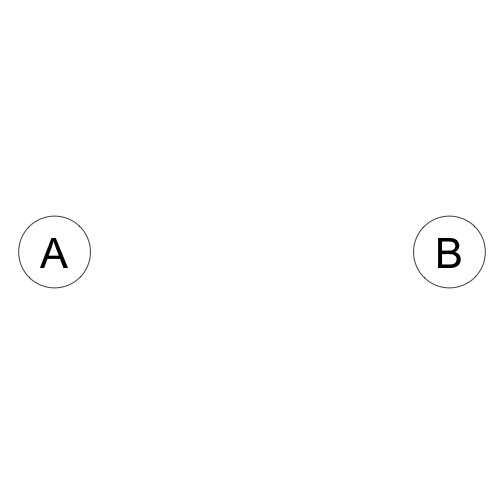
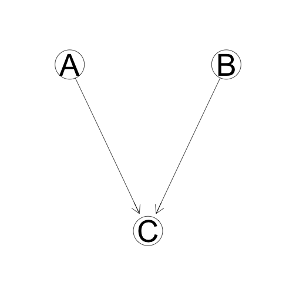
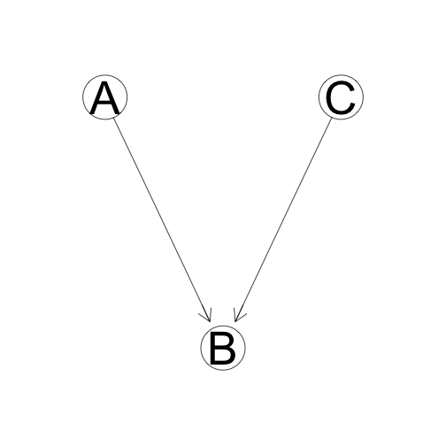
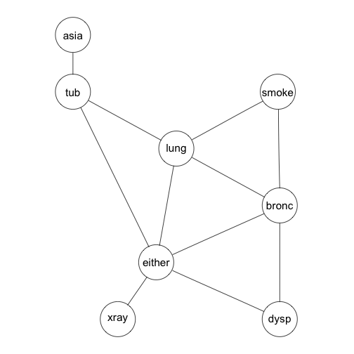
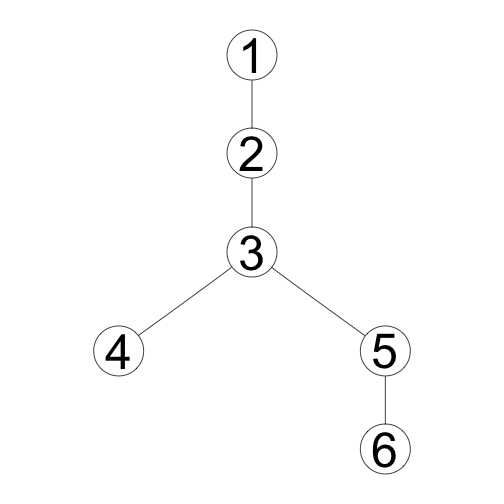

## Why Graphical Models

> 1. Express probabilities for inference on knowledge graphs
> 2. Generalize many different algorithms for machine learning
> 3. Organize complex multivariate models to make inference tractable

--- .class #id 

## What Are Graphical Models?

Graphs with random variables at the nodes.


> * Bayesian Graphical Models - Directed acylic graphs


> * Markov Graphical Models - Undirected graphs


> * Mixed Models - Directed and undirected edges

--- &twocol

## Bayesian Graphical Models - Directed acylic graphs (DAGs)
*** =left
 

*** =right
Diagnosing chest problems.  This directed graph organizes conditional relationships between different variables related to causes and symptoms of lung problems.

--- &twocol
## Markov Graphical Models - Undirected graphs
====================================
*** =left
 

*** =right
Some multivariate distributions cannot be represented by directed graphs.  One example is the so-called misconception problem.  In this case we have four people, A, B, C, and D some of whom have a misconception relation with each other:
A misunderstands B 40% of the time, B misunderstands A 15% of the time and so on.  the misconception relation is represented by the undirected edge between two people nodes on the graph.

--- &twocol
## DAGs and Probabilities

*** =left
In general the graph of a distribution will be fully connected.

This graph represents a distribution that is something like $P(A,B,C,D,E)$.

We would like to make the graph simpler to reduce the complexity and make it easier to infer results from the distribution.

We can simplify the graph by looking for **Conditional Independencies**.

*** =right
 

---
## Simplifying Joint Probabilities

Bayesian Graphical models use some basic rules of probability theory, as well as some simple definitions, to simplfy inference over complicated joint distributions.

> * Chain Rule for joint distributions:  $P(A,B,C) = P(A)P(B|A)P(C|A,B)$

> * Bayes' Rule: $P(A|B) = \frac{P(A)P(B|A)}{P(B)}$

> * Independence: $A \perp B \rightarrow P(A,B) = P(A)P(B)$

> * Conditional Independence: In distribution P, A is conditionally independent of B given C.

> * $P \models (A \perp B | C) \rightarrow P(A|B,C) = P(A|C)$

--- &twocolborder
<!-- Limit image width and height -->
<div class=small-img>
<style type="text/css">
.small-img img {     
  max-height: 350px;
  max-width: 400px;
}
</style>

## Independencies on Graphs

How can directed graphs represent independencies in a distribution?

*** =left
<style type="text/css">
.p left {     
  text-align:left;
}
</style>

<p class="left">
A is independent of B

 
 $$A \perp B$$
 $$P(A,B) = P(A)P(B)$$
 
*** =right

A is **conditionally** independent of B given C: 

 
 $$A \perp B|C$$
 $$P(A,B,C) = P(A)P(B)P(C|A,B)$$
</div>

--- &fourcol
<style type="text/css">
#slide-8 img {     
  max-height: 450px;
  max-width: 200px;
}
</style>

## Conditional independence and inference

In the case where Two Nodes A and C are separated, when does knowledge of A infer knowledge of B?  When is knowledge of A independent of knowledge of B?  There are four basic graph expressions to represent different models of inference.

<style type="text/css">
.p {     
  text-align:center;
}
</style>

*** =left1

<p>
Causal Trail

 

C is Indirectly 'Caused' by A _unless_ we know B.  If we know B, then C and A are independent.


*** =left2
Evidential Trail

 

C indirectly provides evidence for A _unless_ we know B.  If we know B, then C and A are independent.

*** =right2
Common Cause

 

Both A and C are "caused" by (dependent on) B.  If B is known, A and C are independent.

*** =right1
Common Effect

 

B is dependent on both A and C, but A and C are relatively independent unless B is known.

</div>

---

## Features of Graphical Models

> * Naturally and visually express relationships between random variables

> * Easily visualize and calculate marginal probabilities.

> * Well-understood exact and approximate inference algorithms.

> * Easily visualize the composition of models over common variables.

---

## Bayesian Network Inference in R

In the rest of this presentation we use the following packages:

> * gRain - Graphical Models with discrete distributions

> * gRim - Graphical Interaction Models.  Create log-linear models from tabular data

> * Rgraphviz - Produce most of the graphs in this presentation.

---

## Example:  The Chest Clinic Example using gRain
We can look  at a simple example of a joint distribution over discrete Binary valued random variables.  The Chest clinic example[1] uses the following varianbles:

* A = Asia (Has the subject visited Asia?)
* S = Smoker (Does the subject Smoke?)
* T = Tuberculosis (Does the subject have tuberculosis?)
* L = Lung Cancer
* B = Bronchitis
* D = Dyspnoea (Is the subject experiencing shortness of breath?)
* X = X-ray (Has the subject had a chest X-ray done?)
* E = Either (Does the subject have either tuberculosis or lung cancer?)

With these eight variables we will create a directed acyclic graph (DAG) that lets us reduce the joint probability to a tractable form.  

---
<style type="text/css">
#slide-12 img {     
  max-height: 300px;
  max-width: auto;
}
</style>

## Example:  The Chest Clinic Example Continued

given the variables $V = {A, S, T, L, B, E, D, X}$, we have a joint probability $p(\theta_v)$ where $\theta_v$ is a particular set of values of each of the variables in $V$.


```r
g<-list(~asia, ~tub | asia, ~smoke, ~lung | smoke, ~bronc | smoke, 
        ~either | lung : tub, ~xray | either, ~dysp | bronc : either)
chestdag<-dagList(g)
```

Which produces the following DAG:

 


---
## Example:  The Chest Clinic Example Continued

Using this dependency model we can add some example conditional probability tables:


```r
yn <- c("yes", "no")
a <- cptable(~asia, values = c(1,99), levels = yn)
t.a <- cptable(~tub + asia, values = c(5, 95, 1, 99), levels = yn)
s <- cptable(~smoke, value = c(5, 5), levels = yn)
l.s <- cptable(~lung + smoke, values = c(1,9,1,99), levels = yn)
b.s <- cptable(~bronc + smoke, values = c(6, 4, 3, 7), levels = yn)
e.lt <- cptable(~either + lung + tub, values = c(1, 0, 1, 0, 1, 0, 0, 1), levels = yn)
x.e <- cptable(~xray + either, values = c(8, 2, 5, 95), levels = yn)
d.be <- cptable(~dysp + bronc + either, values = c(9, 1, 7, 3, 8, 2, 1, 9), levels = yn)
```

---
## Example:  The Chest Clinic Example Continued

we compile the model like this:


```r
plist <- compileCPT(list(a, t.a, s, l.s, b.s, e.lt, x.e, d.be))
grn1 <- grain(plist)
summary(grn1)
```

```
## Independence network: Compiled: FALSE Propagated: FALSE 
##  Nodes : chr [1:8] "asia" "tub" "smoke" "lung" "bronc" "either" ...
```

---
## Example:  The Chest Clinic Example Continued

In order to perform queries on the tree we have to compile and propogate the model.  This is done as follows:


```r
grn1c <- compile(grn1, propagate = TRUE)

summary(grn1c)
```

```
## Independence network: Compiled: TRUE Propagated: TRUE 
##  Nodes : chr [1:8] "asia" "tub" "smoke" "lung" "bronc" "either" ...
##  Number of cliques:                 6 
##  Maximal clique size:               3 
##  Maximal state space in cliques:    8
```

---  &twocol
<style type="text/css">
#slide-16 img {     
  max-height: 300px;
  max-width: auto;
}
</style>

## Example:  The Chest Clinic Example Continued

Compilation of the directed graph comprises:

> * Link all parents of a node

> * Convert the graph from directed to undirected

> * Create a clique tree for the resulting undirected graph.

*** =left

 

*** =right
 

---


```r
tmg <- triangulate(moralize(grn1$dag))
rip(tmg)$cliques
```

```
## [[1]]
## [1] "asia" "tub" 
## 
## [[2]]
## [1] "either" "lung"   "tub"   
## 
## [[3]]
## [1] "either" "lung"   "bronc" 
## 
## [[4]]
## [1] "smoke" "lung"  "bronc"
## 
## [[5]]
## [1] "either" "dysp"   "bronc" 
## 
## [[6]]
## [1] "either" "xray"
```

---
## Example:  The Chest Clinic Example Continued

We can print the rip-ordering of the cliques:

 

---
## Example:  The Chest Clinic Example Continued - Querying with Evidence

Suppose that a person has visited asia and suffers from shortness of breath.  What are the marginal probabilities that the person has lung cancer or brochitis?


```r
grn1c.ev <- setFinding(grn1c, nodes=c("asia", "dysp"), states=c("yes","yes"))
querygrain(grn1c.ev, nodes=c("lung","bronc"), type="marginal")
```

```
## $lung
## lung
##        yes         no 
## 0.09952515 0.90047485 
## 
## $bronc
## bronc
##       yes        no 
## 0.8114021 0.1885979
```

---
## Example:  The Chest Clinic Example Continued - Querying with Evidence

How does this change if the person is a smoker?


```r
grn2c.ev <- setFinding(grn1c, nodes=c("asia","dysp","smoke"), 
                       states=c("yes","yes","yes"))
querygrain(grn2c.ev, nodes=c("lung","bronc"), type="marginal")
```

```
## $lung
## lung
##       yes        no 
## 0.1455191 0.8544809 
## 
## $bronc
## bronc
##       yes        no 
## 0.8672582 0.1327418
```

---
## Summary

> * Motivation for using Graphical Models

> * Simple Algorithm for Inference

> * An example showing graph construction and inference

> * Show how evidence affects predictions on the graph

> * Show basic commands in the gRain package.

---
## Other Topics

> * Markov Networks

> * Inferring graph structure from data

> * Recurring graphs (Modeling temporal systems)

> * Modeling causality on graphs

> * Partially observable varaibles on a graph.

---
## Thank you! 

Questions or Comments?
